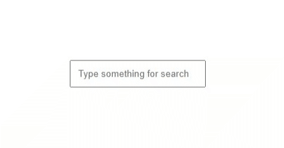

# Awesome-CSS-Tricks
In this repo, I'll list some of the CSS trics I like what make things easy.
I hope these tricks make things easier for you when writing CSS.


- [**Show Button with Focus**](https://github.com/dmrdvn/Awesome-CSS-Tricks/tree/main/Show%20Button%20with%20Focus)

```CSS
button {
    display: none;
}

input:not(:placeholder-shown) + button {
    display: block;
}
```
### Output:


- [**Card Flip Effect - Woocommerce Style**](https://github.com/dmrdvn/Awesome-CSS-Tricks/tree/main/Card%20Flip%20Effect)

```CSS
.flip-card {
    ...
    perspective: 1000px;
}

.content {
    ...
    transform-style: preserve-3d;
}

.flip-card:hover .content {
    transform: rotateY(180deg);
}

.front, .back {
    ...
    -webkit-backface-visibility: hidden;
    backface-visibility: hidden;
}
```
### Output:

